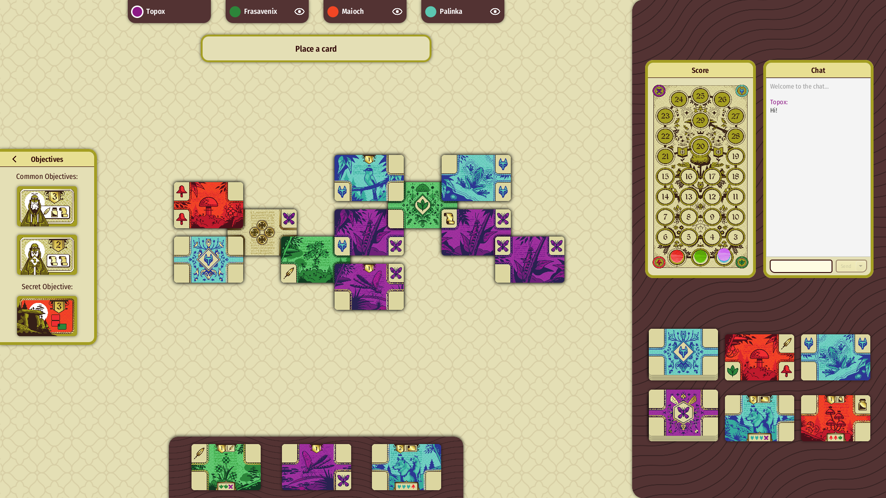
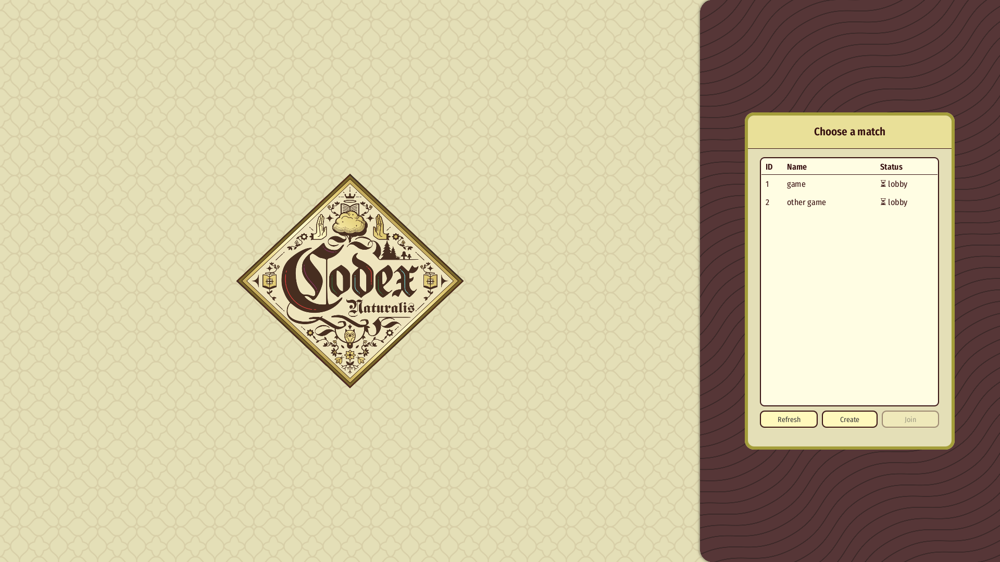
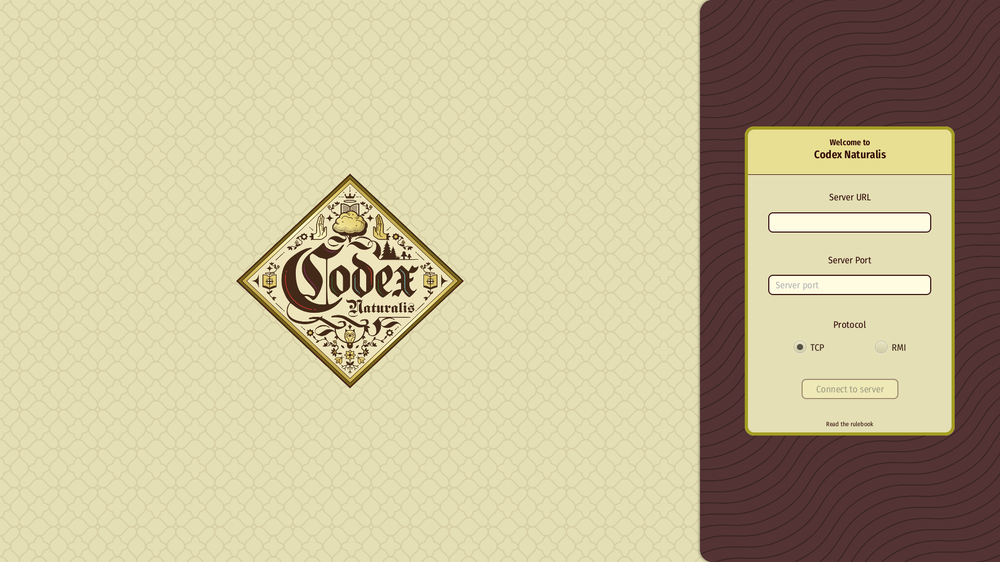

# A Certain Natural Codex (SE-Project-2024)

A full recreation of the board game "Codex Naturalis", made as our final project for the software engineering course held at the Polytechnic University of Milan.

## Screenshots

## Features

📖  Accurate implementation of the game's complete rules\
🔗  Support for multiple network protocols (TCP/RMI)\
📱  A graphical user interface, based on the original game's design language\
🖥️  A command line interface fallback, for operating systems where JavaFX isn't supported\
🎮  Support for multiple concurrently running games on the same server\
🗨  In-game chat, including the ability to whisper to a limited set of players\
🔄  Full client reconnection support, regardless of which phase the game is in
## Tools

- UML and sequence diagram creation: [Draw.io](https://draw.io)
- Main IDE: [IntelliJ IDEA Ultimate](https://www.jetbrains.com/idea/)
- Preliminary user interface draft: [Figma](https://www.figma.com/)
- Graphical user interface design: [Scene Builder](https://gluonhq.com/products/scene-builder/)

## Libraries

- [Jackson](https://github.com/FasterXML/jackson), to read JSON files
- [JavaFX](https://github.com/openjdk/jfx), to create a cohesive and responsive GUI
- [JUnit 5](https://github.com/junit-team/junit5), used for testing
## Authors

- [Andrea Fidanza](https://github.com/Andrea-Fidanza)
- [Marco Maiocchi](https://github.com/Maioch)
- [Francesco Saverio Nisoli](https://github.com/Frasavenix)
- [Guglielmo Gatti](https://github.com/topox19547)

## License
Codex Naturalis belongs to Cranio Creations and Studio Bombyx.
All of the copyrighted assets used in this project were supplied by the Polytechnic University of Milan with permission from the copyright holders.
